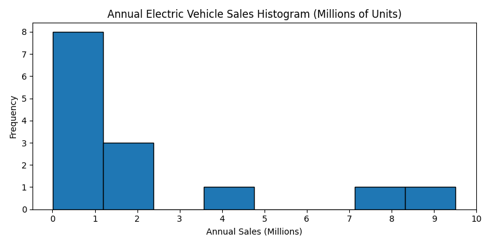
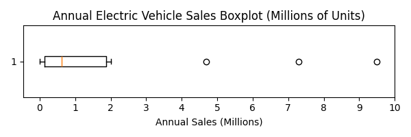

# 🚗 Electric Vehicle Sales – Statistical Data Analysis

This repository contains a full statistical analysis of global **Battery Electric Vehicle (BEV)** sales from 2010 to 2024.  
The project is built in Python and includes descriptive statistics, outlier detection, confidence interval construction, hypothesis testing, and data visualizations.

## 📊 Dataset Description

- **Source**: [Kaggle – Electric Car Sales Dataset](https://www.kaggle.com/datasets/arthurp/electric-car-sales)  
- **Focus**: Global annual sales of BEVs in the "Cars" category  
- **Columns Used**: `region`, `year`, `value`  
- Only rows with:
  - `parameter` = "EV sales"  
  - `mode` = "Cars"  
  - `powertrain` = "BEV"  
  were selected.

---

## 📈 Project Contents

| Section                       | Description                                                                 |
|------------------------------|-----------------------------------------------------------------------------|
| `analysis.py`                | Data cleaning, descriptive stats, outlier detection, confidence intervals, hypothesis testing |
| `grafik.py` / `grafik_turkce.py` | Histogram and boxplot visualizations (Turkish & English label versions)        |
| `electric_car_sales.csv`     | Original dataset (Kaggle)                                                   |
| `output/`                    | Contains generated `.csv` and `.png` result files                           |

---

## 📌 Analysis Highlights

- **Mean Annual Sales**: ~5.52 million units  
- **Standard Deviation**: ~5.79 million  
- **95% Confidence Interval**: (2.59M , 8.45M)  
- **Hypothesis Test**:  
  - H₀: Mean = 6M  
  - Result: **Rejected** (p = 0.00027)  
- **Sample Size Needed (±0.1 margin, 90% confidence)**: 2442 years  

---

## 📷 Example Visuals

  
   
  <em>Annual Sales Histogram</em>

  
   
  <em>Annual Sales Boxplot</em>

---

## 📦 Libraries Used

- pandas  
- numpy  
- matplotlib  
- scipy.stats  
- os

---

## 📺 Video Presentation

📌 YouTube link: _[Insert your YouTube video link here]_

---

## 👤 Author

- **Name**: Yunus Osmanoglu 
- **Student ID**: 2221221363
- **Course**: Statistics and Probability for Computer Engineers  
- **Instructor**: Dr. Sultan ZEYBEK

---

## ✅ License

This project is for academic purposes only.
